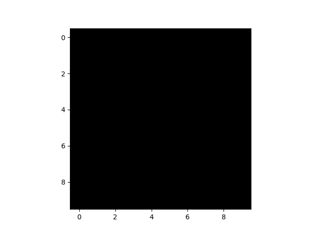
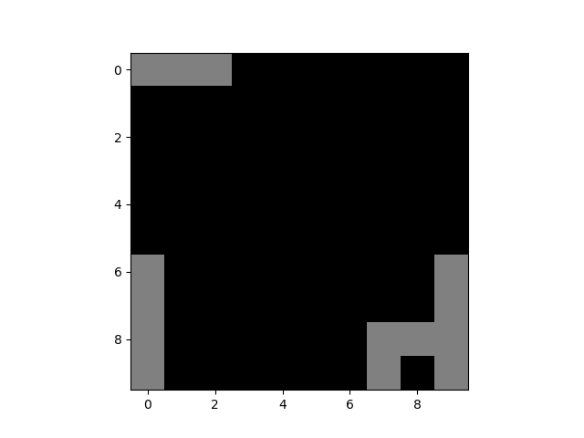
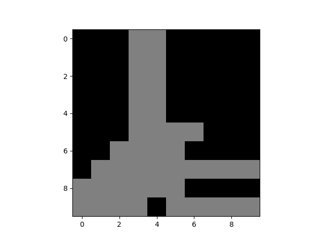

**Assignment 3**

**Table of Contents**
<!-- TOC -->

- [Introduction](#introduction)
    - [Install Dependencies](#install-dependencies)
- [Pseudocode](#pseudocode)
- [Code](#code)
    - [How the files are structured](#how-the-files-are-structured)
        - [model.py](#modelpy)
        - [main.py](#mainpy)
    - [How to run the code](#how-to-run-the-code)
- [Results and Observations](#results-and-observations)
    - [Observations and Personal Conclusions](#observations-and-personal-conclusions)
    - [Interesting Experimentation](#interesting-experimentation)
- [Resources](#resources)

<!-- /TOC -->

# Introduction

Pulse coupled oscillators are **limit cycle oscillators that are coupled in a pulsatile rather than smooth manner**[^1].

What the statement means is:

If you put together objects that oscillate (glowing or moving about a fixed point, etc), in a discrete time frame, their oscillation will interact with each other and cause them to couple together and oscillate in unison.

Examples:
- Flyflies glowing in unison after some time being together.
- Mechanical Oscillators syncing to oscillate together.
- Menstrual Cycles of Women who live together matching up with time.


[^1]: *Source: [Pulse Coupled Oscillator](http://www.scholarpedia.org/article/Pulse_coupled_oscillators)*

## Install Dependencies

Install all the essential Python dependencies using:

```sh
pip3 install -r requirements.txt
```

# Pseudocode

Traverse through each of the cell. Create individual 2D Array to store `c (counter_grid)` and `state (grid)`

```sh
init:
    state = 0
    c = random(0,T)

step:
    c = c + 1
    if(a neighbor flashed)
        c = c + (k * c)
    if(c >= T)
        state = 1
        c = 0
    else
        state = 0
```

In the above algorithm:
- `c` (`counter_grid`) is an internal counter.
- `T` (`max_value`) is the max value that `c` can reach. In our case, T = 100
- `k` (`constant`) is a constant between 0 and 1.

# Code

Import Essential Libraries

```py
import os
import numpy as np
from matplotlib import pyplot as plt
import random
```

Information about what a color means on the screen

```py
# ---------------------------------------------------------------------------- #
#                               COLOR INFORMATION                              #
# ---------------------------------------------------------------------------- #
# BLACK -> EMPTY CELL
# WHITE -> FLASHING
```

Basic Definitions

```py
# ---------------------------------------------------------------------------- #
#                             VARIABLE DECLARATION                             #
# ---------------------------------------------------------------------------- #
grid_width = 10  # Screen Width
grid_height = 10  # Screen Height
max_value = 100  # T

# Initialize the Grid with zeros
counter_grid = np.zeros((grid_width, grid_height), dtype=float)
grid = np.zeros((grid_width, grid_height), dtype=int)
```

Set the Value of each cell in `counter_grid` with a random number between 0 and `max_value`

```py
def initialize_basics_requirements():
    # Randomly Put the cells as Empty or Flashing
    for y in range(grid_height):
        for x in range(grid_width):
            counter_grid[y, x] = random.randint(0, max_value)
```

Define the Function to initiate the pulse-coupled oscillation. It takes `constant` as an input.

`k = constant`

```py
def coupled_oscillation_model(constant):
```

We shall run the simulation for `1000` times to check if sync is met or not.

```py
for iteration_number in range(20000):
```

Increment the counter for each of the cells every iteration. If the value of counter if greater than `max_value`, we set the state of the corresponding set as `1` else set it as `0`.

```py
for y in range(grid_height):
    for x in range(grid_width):
        counter_grid[y, x] += 1

        if (counter_grid[y, x] >= max_value):
            grid[y, x] = 1
            counter_grid[y, x] = 0
        else:
            grid[y, x] = 0
```

We go through the grid cells one by one and check if the the current cell is `0`. If it is, we check the neighboring cells if they are flashing or not. If they are, we set the `neighbors_flashing` variable as `True` and finally increment the `counter_grid` of the corresponding cell.

We again check if the value of counter if greater than `max_value`, we set the state of the corresponding set as `1` else set it as `0`.

```py
for y in range(grid_height):
    for x in range(grid_width):
        if (grid[y, x] == 0):
            neighbors_flashing = False

            if (y > 0):
                if (grid[y-1, x] == 1):
                    neighbors_flashing = True
            if (y < grid_height-1):
                if (grid[y+1, x] == 1):
                    neighbors_flashing = True
            if (x > 0):
                if (grid[y, x-1] == 1):
                    neighbors_flashing = True
            if (x < grid_width-1):
                if (grid[y, x+1] == 1):
                    neighbors_flashing = True
            if (neighbors_flashing):
                counter_grid[y, x] = counter_grid[y, x] + (constant*counter_grid[y, x])
                if (counter_grid[y, x] >= max_value):
                    grid[y, x] = 1
                    counter_grid[y, x] = 0
                else:
                    grid[y, x] = 0
```

We save the plot every iteration as a `.png` file.

```py
file_name = f"{folder_name}/Iteration {iteration_number}.png"
plt.imshow(grid, vmin=0, vmax=1, cmap="gray")
plt.savefig(file_name)
print(f"\t\tIteration {iteration_number}")
```

At the end of the complete code, we compile all the images into a `.gif` file.

```py
# Combine all the images saved into a .gif
os.system(f"cd {folder_name} && convert -delay 20 -loop 0 *.png coupled_oscillation.gif")
```

## How the files are structured

### model.py

Script contains the actual pulse-coupled biological oscillator model

### main.py

Contains a loop which imports the `model.py` file as a header and call the model with different values of `k`.

## How to run the code

Open the terminal and run the code:

```sh
python3 main.py
```

# Results and Observations

- k = 0.1

    

- k = 0.2

    

- k = 0.3

    

- k = 0.4

    

- k = 0.5

    

- k = 0.6

    

- k = 0.7

    

- k = 0.8

    

- k = 0.9

    

- k = 1

    

## Observations and Personal Conclusions
- When perfect synchronization does not happen, blocks tend to form smaller groups which oscillate in negation of each other as their inverses.
- Synchronization fails for k = 0.1
- We start seeing 3-4 different coupled oscillations for k = 0.2
- After few 100 initial iterations of failed synchronization, Perfect Synchronization can be seen for k = 0.3, 0.6, 0.7, 0.8, 0.9 and 1.
- k = 0.5 has 2 groups which oscillate in opposition of each other.

## Interesting Experimentation
- If the counter is updated every time a neighbor is flashing and not just when any neighbor is flashing, we can achieve perfect synchronization in oscillations.

# Resources
- [Synchronization of Pulse-Coupled Biological Oscillators\
Renato E. Mirollo and Steven H. Strogatz\
SIAM Journal on Applied Mathematics 1990 50:6, 1645-1662](https://epubs.siam.org/doi/10.1137/0150098)
