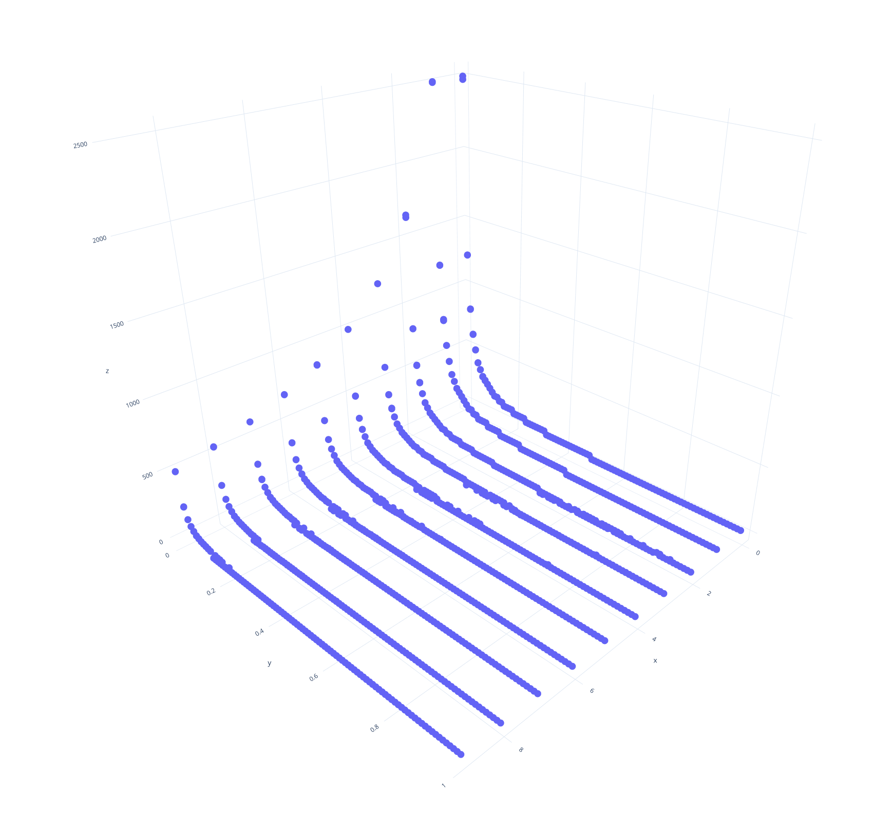

**Assignment 3: Group Size Detection**

**Table of Contents**
<!-- TOC -->

- [Introduction](#introduction)
    - [Install Dependencies](#install-dependencies)
- [Pseudocode](#pseudocode)
    - [How the files are structured](#how-the-files-are-structured)
        - [model.py](#modelpy)
        - [main.py](#mainpy)
    - [How to run the code](#how-to-run-the-code)
- [Results and Observations](#results-and-observations)
    - [Plot](#plot)
    - [Observations](#observations)
        - [Values of P and R that produces the best estimate](#values-of-p-and-r-that-produces-the-best-estimate)
        - [Does it matter if we use 4-distance or 8-distance?](#does-it-matter-if-we-use-4-distance-or-8-distance)
        - [Possible Improvement in the Algorithm](#possible-improvement-in-the-algorithm)
- [Resources](#resources)

<!-- /TOC -->

# Introduction
Quorum sensing is **the regulation of gene expression in response to fluctuations in cell-population density**. Quorum sensing bacteria produce and release chemical signal molecules called autoinducers that increase in concentration as a function of cell density.


## Install Dependencies

Install all the essential Python dependencies[^1] using:

```sh
pip3 install -r requirements.txt
```

[^1]: *The complete code has been written on Ubuntu 20.04 LTS and not tested on any other system.*

# Pseudocode

```py
input:
    W = grid width [int]
    H = grid height [int]
    P = initiation probability [float]
    R = refractorytimer [int]

init:
    initiated = false [boolean]
    size = 0 [int]
    state = Susceptible

step:
    if (state == Susceptible)
        if (neighbor signalled)
            emit signal
            state = Refractory
            refractorytimer = R
            size = size + 1
        elif (not initiated) and (random() < P)
            emit signal
            state = Refractory
            refractorytimer = R
            initiated = true
            size = size + 1
        endif
    else
        refractorytimer = refractorytimer - 1
        if (refractorytimer <= 0)
            state = Susceptible
        endif
    endif
```

## How the files are structured

### model.py

Script contains the actual Group size detection model which takes the input:

- `width`: Grid Width (int: > 0)
- `height`: Grid Height (int: > 0)
- `probability`: Initiation Probability (P) (float: 0.01 - 1)
- `refractory_timer`: Number of steps before being susceptible again (P) (int: > 0)

### main.py

Contains a loop which imports the `model.py` file as a header and call the model with different values of `width`, `height`, `P` and `R`.

## How to run the code

Open the terminal and run the code:

```sh
python3 main.py
```

# Results and Observations

## Plot

- `X-Axis`: Refractory Period (1 - 10)
- `Y-Axis`: Probability (0.01 - 1)
- `Z-Axis`: Max Grid Size



## Observations

### Values of P and R that produces the best estimate

- For Estimated Value of M: 100, (R,P) pairs:
    - 0, 0.21
    - 0, 0.22
    - 0, 0.23
    - 0, 0.24
    - 0, 0.25
    - 1, 0.21
    - 1, 0.22
    - 1, 0.23
    - 1, 0.24
    - 1, 0.25
    - 2, 0.15
    - 2, 0.16
    - 3, 0.12
    - 4, 0.1
    - 5, 0.08
    - 6, 0.07
    - 7, 0.06
    - 9, 0.05

### Does it matter if we use 4-distance or 8-distance?
- 4 distance: 33 versions reached the size estimation of 100
- 8 distance: 16 versions reached the size estimation of 100

As the neighbors nearby are increased for flashing check, the accuracy of the current rudimentary algorithm reduces.

### Possible Improvement in the Algorithm

- Improve the response of grid by iterating through all neighbors to make immediate change rather than waiting for the next iteration to happen.

# Resources

- [American Society for MicroBiology: How Quorom Sensing Works](https://asm.org/Articles/2020/June/How-Quorum-Sensing-Works)