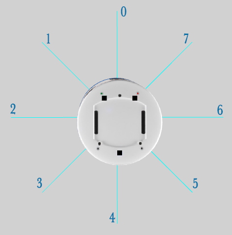
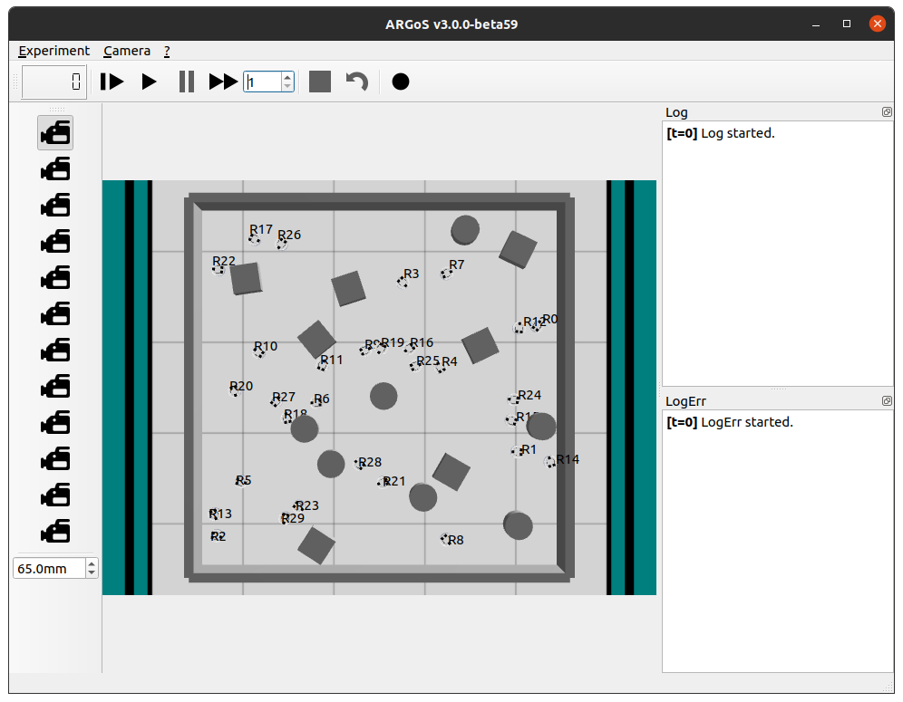
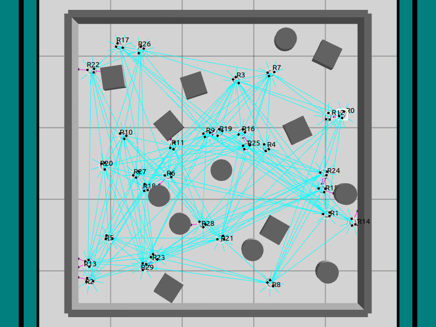

**Assignment 8**

**Table of Contents**
<!-- TOC -->

- [Introduction](#introduction)
- [Install Essentials](#install-essentials)
- [Robot Model](#robot-model)
    - [Proximity Sensor](#proximity-sensor)
    - [Range and Bearing Communication System](#range-and-bearing-communication-system)
- [Code](#code)
    - [Dispersion](#dispersion)
    - [Coupled Oscillation](#coupled-oscillation)
- [How to run the code](#how-to-run-the-code)
- [Simulation Results](#simulation-results)
    - [Starting Frame](#starting-frame)
- [Resources](#resources)
- [Design Details](#design-details)
- [License](#license)

<!-- /TOC -->


# Introduction

The assignment aims to simulate a swarm scenario where robots disperse around the environment while avoiding collisions and trying to simulate coupled oscillations.

# Install Essentials

Three essential packages are needed to run this project:

- ARGoS (Swarm Simulation Software)
- Buzz (Programming Language for ARGoS)
- Khepera IV Robot (Robot used for simulation)

The complete installation guide can be found [here](./Docs/argos_buzz_installation.pdf).

# Robot Model

## Proximity Sensor

The proximity sensor on the robot is made up of 8 total sensors and is numbered as follows.



## Range and Bearing Communication System

Range and Bearing Communication system is a feature in ARGoS where it connects and communicates with all the other robots in direct line of sight. Using this, it can communicate with its neighbors using publisher and subscriber networks along with having the possibility to transmit position and orientation.

# Code

## Dispersion

```cpp
function go_to_random_location_while_avoiding_obstacles(){
    # Check if any front sensors are triggered. True -> Stop Robot, False -> Check for Rotation
    if((proximity[0].value > proximity_flag_val)&(proximity[1].value > proximity_flag_val)&(proximity[7].value > proximity_flag_val))
        gotop(0,0);

    # Check if front sensor is triggered. True -> Turn Right
    else if(proximity[0].value > proximity_flag_val)
        gotop(0,velocity_val);

    # Check if front left sensor is triggered. True -> Turn Right
    else if(proximity[1].value > proximity_flag_val)
        gotop(0,velocity_val);

    # Check if left sensor is triggered. True -> Turn Right
    else if(proximity[2].value > proximity_flag_val)
        gotop(0,velocity_val);

    # Check if front right sensor is triggered. True -> Turn Left
    else if(proximity[7].value > proximity_flag_val)
        gotop(0,-velocity_val);

    # Check if right sensor is triggered. True -> Turn Left
    else if(proximity[6].value > proximity_flag_val)
        gotop(0,-velocity_val);

    # Move Forward
    else
        gotop(velocity_val,0);
}
```

## Coupled Oscillation

Increment the `counter` and check if any neighbor flashed. If `c>=T`, flash light else don't.

```cpp
c = c+1;
neighbors.listen("flash", neighbor_flashed);
if(c>=T){
    set_leds(255,255,255);
    neighbors.broadcast("flash",true);
    c = 0;
}
else{
    set_leds(0,0,0);
}
```

Check `neighbor_flashed()` function

```cpp
function neighbor_flashed(){
    c = c+(k*c);
}
```

# How to run the code

Open the terminal and run the code:

```sh
argos3 -c hw8.argos
```

Two windows will pop up:

- ARGoS window
  
- Buzz Editor
  

Select `File->New/Open->hw8.bzz` to load the code script.

Press Execute (Gear Shaped Icon) to run the script.

Press Run in the ARGoS Window to start the simulation.

# Simulation Results

## Starting Frame

- The first initiated frame is shown below:
  
  

- Simulation Video displaying Dispersion and Coupled Oscillation:

  

# Resources

- [Synchronization of Pulse-Coupled Biological Oscillators
  Renato E. Mirollo and Steven H. Strogatz
  SIAM Journal on Applied Mathematics 1990 50:6, 1645-1662](https://epubs.siam.org/doi/10.1137/0150098)
- [ARGoS Simulator](https://www.argos-sim.info/)
- [Buzz Wiki](https://the.swarming.buzz/wiki/doku.php?id=start)

# Design Details
- Designed for:
  - Worcester Polytechnic Institute
  - RBE 595-S07 - ST: Swarm Intelligence Assignments
- Designed by:
  - [Parth Patel](mailto:parth.pmech@gmail.com)

# License

This project is licensed under [GNU General Public License v3.0](https://www.gnu.org/licenses/gpl-3.0.en.html) (see [LICENSE.md](LICENSE.md)).

Copyright 2023 Parth Patel

Licensed under the GNU General Public License, Version 3.0 (the "License"); you may not use this file except in compliance with the License.

You may obtain a copy of the License at

_https://www.gnu.org/licenses/gpl-3.0.en.html_

Unless required by applicable law or agreed to in writing, software distributed under the License is distributed on an "AS IS" BASIS, WITHOUT WARRANTIES OR CONDITIONS OF ANY KIND, either express or implied. See the License for the specific language governing permissions and limitations under the License.