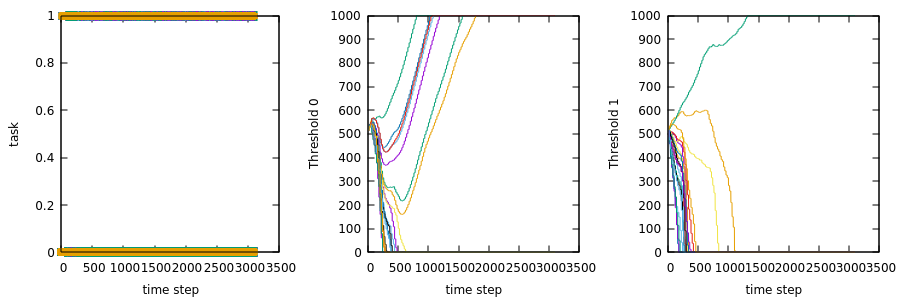

**Homework 9: Theraulaz Model**

<!-- TOC -->

- [Introduction](#introduction)
- [Files](#files)
- [Simulation Parameters](#simulation-parameters)
- [Results and Observations](#results-and-observations)

<!-- /TOC -->

# Introduction
The threshold model proposed by Theraulaz et al. is a mathematical model that explains how individual agents in a swarm determine their behavior based on the stimulus received from their environment and the behavior of other agents. The model assumes that each agent has a threshold value that determines its response to a particular stimulus. If the stimulus is below the threshold value, the agent ignores it, but if it exceeds the threshold value, the agent responds accordingly.

In the Homework 9 Exercise 1, this model is implemented to study the specialization behavior of robots in a swarm. Each robot has a threshold value for two tasks, and the goal is to observe if robots specialize in one task or perform both tasks equally. The experiment records the behavior of each robot and analyzes the data to draw conclusions about the specialization behavior of the swarm.

# Files

**threshold_model.bzz**: Code to execute the threshold model.\
**plot.gp**: Code to plot the graphs.

# Simulation Parameters

- $\xi = 10$
- $\phi = 1$
- $p = 0.2$
- $dt = 20$
- Total Tasks = 2

<!-- # Formulae

**Update Threshold**

$\theta(t) = \theta(t-1) + dt(\phi(1-x(t-1)) - \xi*x(t-1))$

where $\theta$ => threshold

```py
if (threshold < 1)
    threshold = 1
else if (threshold > 1)
    threshold = 1000
```

# Pseudocode

```py
start -> threshold {500,500}
``` -->

# Results and Observations



***Fig. Left: Task for robot with respect to Time, Middle: Threshold 0 of robots with respect to Time, Right: Threshold 1 of robots with respect to Time***